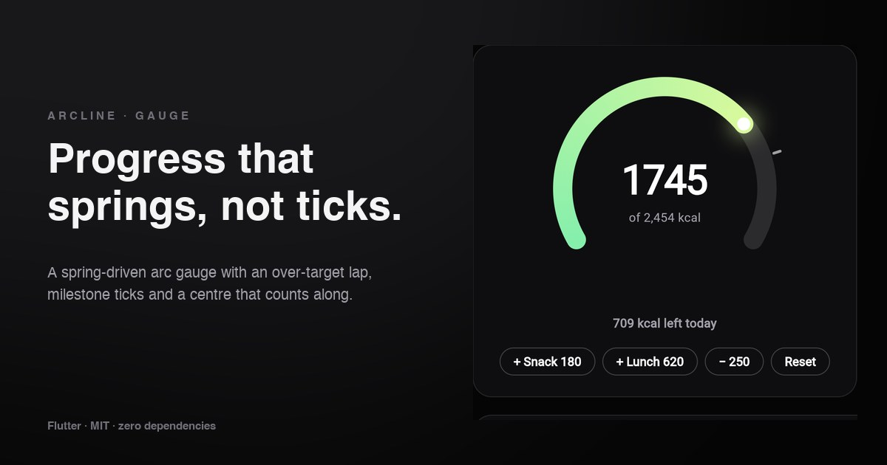

# Arcline

An animated arc gauge for Flutter. The fill **springs** to each new value, a
**second lap** appears once you pass the target, **milestone ticks** mark the
points that matter, and the centre **counts along** with the animation.

**[→ Live demo](https://yagnikbarasiya23.github.io/arcline/)** (the example app, built for the web)



No dependencies beyond Flutter itself.

## Why a spring

Progress gauges usually tween over a fixed duration. When values change
quickly — logging several meals in a row, a live step count — each change
restarts the tween and the arc stutters. Arcline drives the value with a
physics spring that starts from wherever the arc is *and how fast it's
moving*, so rapid updates blend into one smooth motion.

## Install

```yaml
dependencies:
  arcline:
    git:
      url: https://github.com/YagnikBarasiya23/arcline.git
```

Requires Flutter 3.47 or newer.

## Use it

```dart
import 'package:arcline/arcline.dart';

Arcline(
  value: eaten,          // e.g. 1745
  max: target,           // e.g. 2454
  size: 280,
  markers: [target * 0.8],
  semanticLabel: 'Calories today',
  center: (context, value) => Text('${value.round()} kcal'),
)
```

Change `value` with `setState` (or any state management) and the gauge
animates to it.

### Properties

| Property | Default | |
| --- | --- | --- |
| `value` | required | Current amount. Above `max`, a second lap is drawn |
| `max` | required | Amount that fills the arc once |
| `size` | `220` | Width and height |
| `thickness` | `18` | Stroke width |
| `sweepDegrees` | `240` | How much of the circle the arc covers; `360` for a ring |
| `colors` | green → lime | Gradient along the fill |
| `trackColor` | 12 % white | Unfilled track |
| `overColor` | orange | The over-target lap |
| `markers` | `[]` | Values to mark with ticks outside the arc |
| `markerColor` | 60 % white | Tick colour |
| `center` | `null` | `(context, animatedValue) => Widget` |
| `stiffness` | `90` | Spring stiffness; higher arrives sooner |
| `damping` | `14` | Spring damping; lower overshoots more |
| `animateOnMount` | `true` | Fill from zero the first time it's shown |
| `semanticLabel` | `'Progress'` | Read by screen readers with the percentage |

## How it works

**Values, not angles.** `ArcFill.of(value, max)` turns the value into two
numbers: how much of the first lap is filled (0–1) and how far into a second
lap it has gone (0–1). The painter only ever deals with those, so a spring
that overshoots below zero or past twice the target can't draw a broken arc.

**A gap at the bottom, whatever the sweep.** `arcStart(sweep)` starts the arc
so the empty part is always centred at the bottom — a 240° gauge runs from
150° to 30°, a 360° ring starts at the bottom.

**Painting.** The track, the gradient fill and the orange over-target lap are
three `drawArc` calls with round caps. The gradient is a `SweepGradient`
rotated to the start of the arc and started a cap's width early, so the
rounded start takes the first colour instead of wrapping round to the last.
A white knob with a soft glow marks the leading edge — green while under
target, orange once over.

**The spring.** An unbounded `AnimationController` runs a
`SpringSimulation` from its current value and velocity to the new target.
When the simulation settles it snaps exactly onto the target, so a centre
label never ends one unit short. The centre builder gets the animated value
on every frame.

## Accessibility

- The gauge is one semantics node: `semanticLabel` plus the target
  percentage (for example “Calories today, 71%”). The animated centre is
  excluded so screen readers don't hear it count.
- With *reduce motion* enabled (`MediaQuery.disableAnimations`), the gauge
  jumps straight to each value.

## Example app

`example/` is the demo from the link above: a calorie gauge with buttons to
log meals, sliders for sweep, thickness and damping, and three ring gauges.

```bash
cd example
flutter run            # any device
flutter run -d chrome  # the web demo
```

## Tests

```bash
flutter test
```

Covers the fill maths and arc geometry, the mount animation, springing into
the over-target lap, the counting centre, reduced motion and semantics.

## Licence

[MIT](LICENSE) © 2026 Yagnik Barasiya. Use it in personal and client work.

More components at [yagnikbarasiya.com/components](https://www.yagnikbarasiya.com/components).
